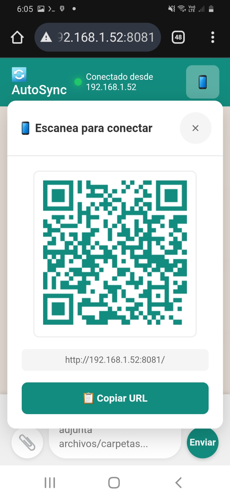
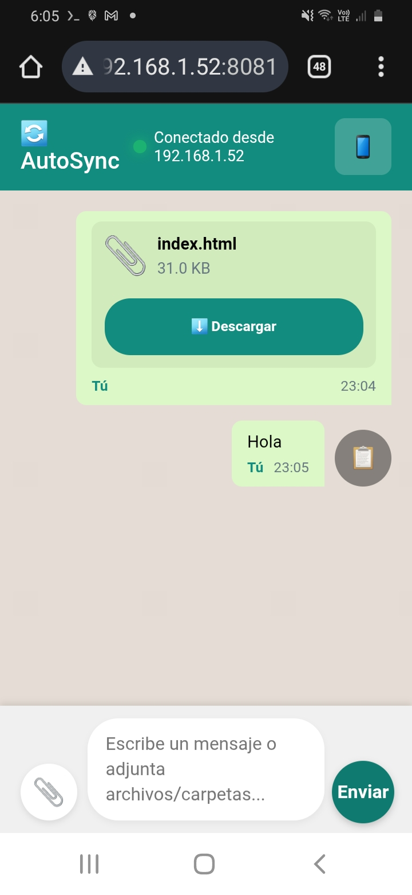
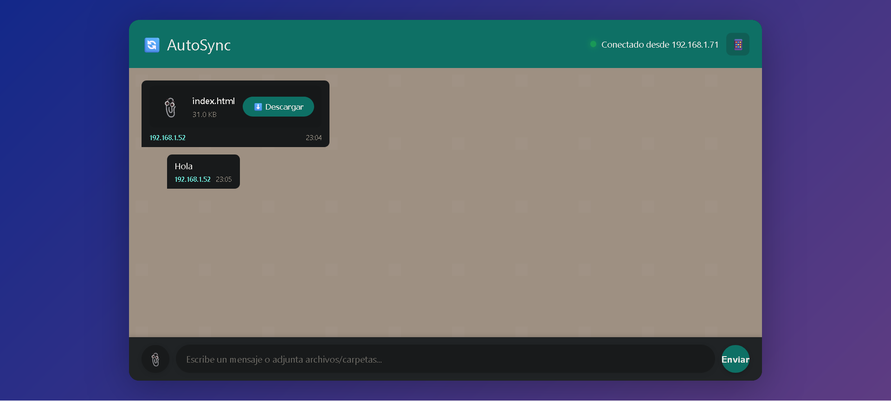

# AutoSyncServer

Un servidor con propósito de compartir archivos offline en una misma red.

## Características

### Acceso móvil con soporte QR y movil

  
  

### Interfaz de escritorio

  

## Ventajas

- ✅ Sin conexión a internet requerida
- ✅ Compartición rápida en red local
- ✅ Acceso fácil mediante código QR
- ✅ Compatible con móviles y PC

---

*Desarrollado para facilitar el intercambio de archivos en entornos offline*
